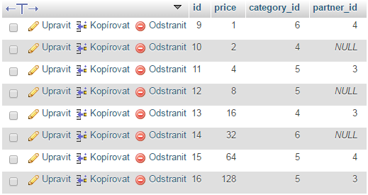
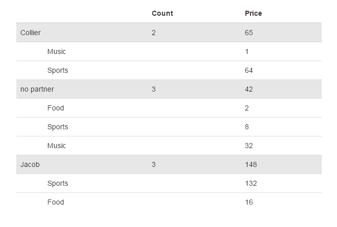

pcz/groupie-nette-component documentation
==================================

This is a UI component for rendering the results provided by the [https://github.com/petrofcz/groupie](https://github.com/petrofcz/groupie) library.
It shows aggreaged data from flat entity collections (see the example below)



... a bit of magic and voila!:



it's possible to customize the template by extending it, see the following example:

```twig
{extends groupieComponent.latte}
{block cell}
	<td><small>{(string)$columnDatas[$i]}</small></td>
{/block}
{block rowTag}style="background: red;"{/block}
{block headerRowExtras}
	<th>Test</th>
{/block}
{block rowExtras}
	<th>{$group->getUid()}</th>
{/block}
```